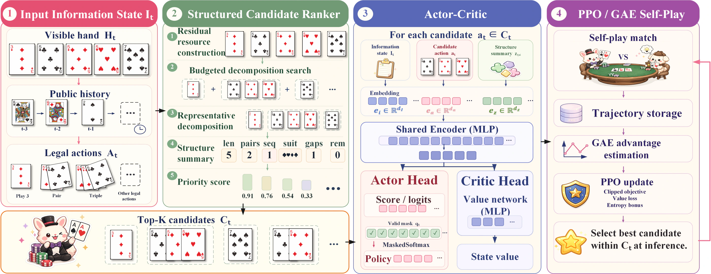
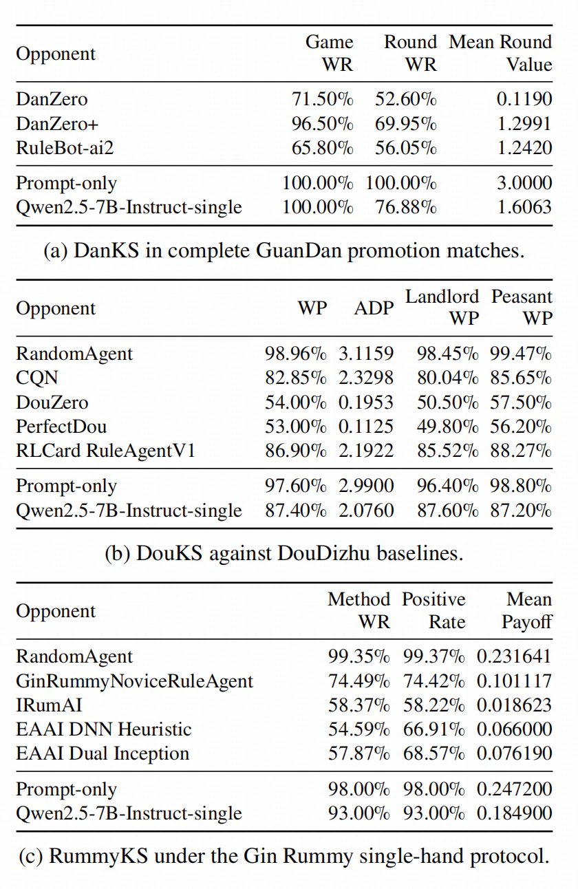
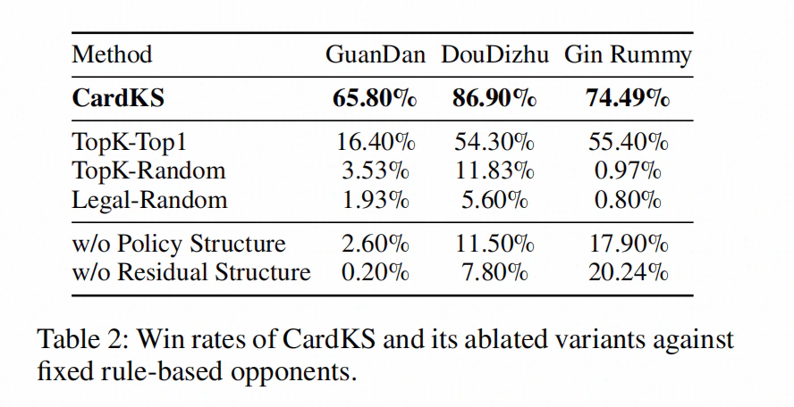
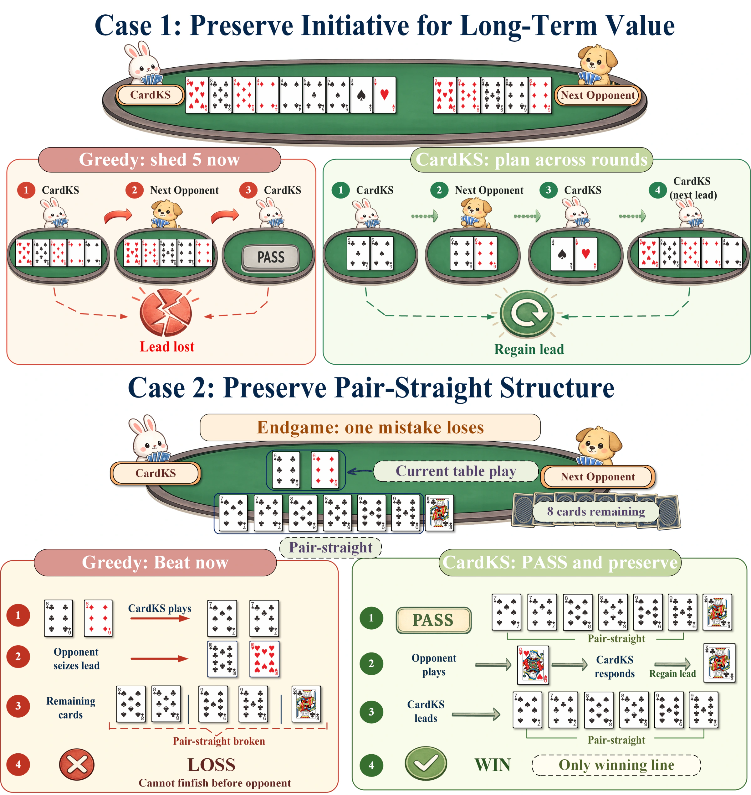

<p align="right">
  <strong>English</strong> · <a href="README.zh-CN.md">简体中文</a>
</p>

<h1 align="center">CardKS</h1>

<p align="center">
  <strong>Residual Key-Structure Modeling for Long-Horizon Decisions</strong>
</p>

<p align="center">
  A unified framework for GuanDan, DouDizhu, and Gin Rummy
</p>

<p align="center">
  <a href="#main-results">Results</a> ·
  <a href="#code-and-resources">Code & Resources</a> ·
  <a href="RESULTS.md">Full Tables</a> ·
  <a href="#citation">Citation</a>
</p>

<p align="center">
  <a href="LICENSE"></a>
  
  
</p>

<p align="center">
  
</p>

CardKS is a unified framework for long-horizon decision-making in imperfect-information card games with large combinatorial action spaces. It evaluates each action by the **key structures preserved in the residual hand**, retrieves a compact Top-K candidate set, and learns context-dependent selection with a candidate-conditioned Actor-Critic trained by PPO self-play.

> **In one sentence:** retrieve actions that preserve future options, then learn when each option matters.

## Main results

CardKS is evaluated in three distinct games under game-specific paired-deal, seed, and role-swapping protocols. The first table reports the complete head-to-head results against learning, search, rule-based, and language-model baselines.

<p align="center">
  
</p>

<p align="center"><sub><strong>Table 1.</strong> Main results for DanKS, DouKS, and RummyKS. Metrics are defined independently for each game.</sub></p>

The ablation study separates the contribution of structured retrieval, residual-hand modeling, and the learned policy. Full CardKS consistently outperforms fixed Top-K selection and structure-removed variants.

<p align="center">
  
</p>

<p align="center"><sub><strong>Table 2.</strong> Win rates against fixed rule-based opponents.</sub></p>

Evaluation protocols, all numeric tables, Recall@K, language-model candidate experiments, efficiency measurements, and dataset statistics are collected in [**RESULTS.md**](RESULTS.md).

## Code and resources

| Component | What it contains | Location |
| --- | --- | --- |
| **DanKS** | GuanDan agent and PPO training implementation | [Open `DanKS/` ↗](https://github.com/Calix-L/DanKS) |
| **DouKS** | DouDizhu agent | [Open `DouKS/` ↗](https://github.com/Calix-L/DouKS) · code forthcoming |
| **RummyKS** | Gin Rummy agent | [Open `RummyKS/` ↗](https://github.com/Calix-L/RummyKS) · code forthcoming |
| **KSPlay** | Shared simulation, self-play, and evaluation platform | [Open `KSPlay/`](./KSPlay) · forthcoming |
| **KS Card Benchmark (KSCB)** | Replay-validated human decision benchmark | [Open `KSCB/`](./KSCB) · forthcoming |

The three agent directories are **Git submodules**. On GitHub, opening one jumps directly to its independent repository. KSPlay and KSCB live in this repository so the common platform and benchmark remain part of the paper-level project.

Clone the complete project, including all currently available agent code, with:

```bash
git clone --recursive https://github.com/Calix-L/CardKS.git
cd CardKS
```

If the repository was cloned without `--recursive`:

```bash
git submodule update --init --recursive
```

DanKS is the first available implementation; its own [README](https://github.com/Calix-L/DanKS#readme) contains environment setup, examples, tests, and PPO training instructions.

## Method at a glance

| Stage | Operation |
| --- | --- |
| **1 · Observe** | Encode the acting player's visible hand, public history, seat context, and legal actions. |
| **2 · Retrieve** | Apply each action, decompose the residual hand, and summarize its future structures. |
| **3 · Select** | Score the compact Top-K support with a candidate-conditioned Actor-Critic. |
| **4 · Learn** | Optimize long-horizon choices through PPO, GAE, and self-play. |

## Emergent long-horizon behavior

The learned policy can prefer non-greedy decisions without hard-coding the illustrated trajectories: preserving a high pair may recover initiative later, while passing can retain the only winning pair-straight continuation.

<p align="center">
  
</p>

## Release boundary

This repository publishes the paper-facing overview, figures, reported tables, and public code links. It does **not** publish manuscript sources, model weights, private datasets, raw evaluation records, credentials, or deployment configuration. Public artifacts will be added only after their licenses and release packages are ready.

## Citation

The final paper link, authors, venue, DOI, arXiv identifier, and BibTeX will be added once the publication record is ready. Until then, [`CITATION.cff`](CITATION.cff) identifies the project without inventing publication metadata.

## License

Code and documentation in this repository are released under the [Apache License 2.0](LICENSE). Model weights, datasets, game assets, and independently released repositories may use different terms.
